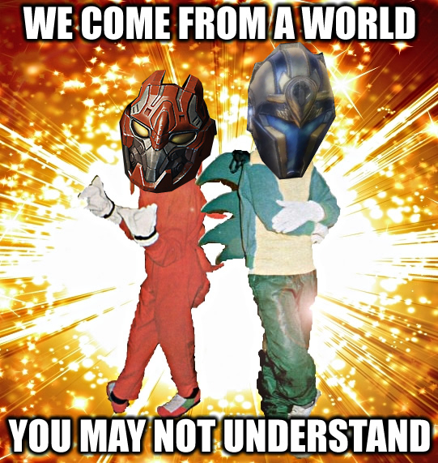
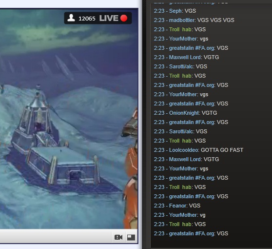
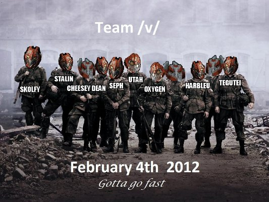

Every Feburary, I usually forget to actively celebrate the anniversary of the Shazbowl. This year I set a calendar alert and I still forgot.

SPACE JAM 3.MP4 is about 10 years old and I’ve had some thoughts build up over the years about Tribes Ascend and the Shazbowl as the genre has changed over the years.

I look back on the Shazbowl and the weeks after it fondly. It might’ve been one of the most life-defining gaming moments I’ve had so far; everyone’s memories on the event itself have faded and my 15 minutes of fame ended a long time ago, but I think the Shazbowl was the first time I’ve ever felt that “hero’s welcome” happen in my life.



The whole brawl, as uploaded by some guy who I forgot the name of.

After the dust cleared following the final battle on Crossfire, we rejoiced in our victory as we believed everyone but the die-hards had simply tuned out of the stream as we were easily bested in the first two rounds. That notion was squashed as people started coming into the Mumble channel we were in to congratulate us and Utah was summoned to talk with the stream hosts.

It was incredible: after hastily begging Harbl to join our rag-tag pick-up game and Cheesy Dean showing up at the last second as I was asking Kalkin (Demoman for x6 Gaming and fellow secret imageboard member) to sub in, we turned a desperate gamble of a game into a massive comeback as Seph landed a confidence-inspiring orbital strike to turn the tide and we rode the momentum to our victory to the tune of several thousand viewers on Twitch.

Looking on /v/, the board absolutely erupted. The board’s title was changed to highlight the most interesting players on our team: a ragtag crew comprised of a BR with 140 ping[^1] and a furry.

Even in the face of all that, we were the shining stars of /v/ during a time where the entire site was being overrun by Reddit migrants. We were the oldheads keeping the culture alive and carrying the flag (literally). This was our era. It was awesome.

Most of the games with the /v/ and /vg/ guys afterwards were a lot of fun. We were all instantly recognized in pub servers for a short time, and there are dozens and dozens of matches lost to the sands of time where we just ran a train on the enemy team or goofed off in spectacular ways.

One of the most important things I learned from the Shazbowl is that a game can be great in terms of gameplay, but having people who make the game worth playing is just as crucial.[^2] It was really difficult to acquire recording software at the time and it ran like crap on my computer, but I’m glad I was able to capture as much as I did because it gave me so much to look back on.

Over the past few years I’ve revisited one video I pieced together about the post-Shazbowl high we all rode for Tribes: Ascend during the initial days of the Open Beta.



Please ignore my atrocious bullet weapon aim, I was always a rockets and shotguns kinda guy

The comments on the video are disorganized and appear odd because of how much YouTube has changed over the years, but two stuck out to me because I feel like they’ve aged quite well given the current gaming landscape:

> Man, this bring me the chills way back In the 90’s.
> When people did not cared about winning, you know?
> I love you guys.

> I wish more people played the game like this. These days, players are either quiet newbloods or tryhards, and the best one can hope for, is a short spam of vgs either mid-game or at the end of the match 😦

The majority of FPS games in the 2020s are soulless matchmaking hellscapes where tournament adjacent competition is the default mode of gameplay. In my opinion, this sole focus has been an absolute disaster for the FPS genre: competitive and casual/normal players should ideally play by the same rules and in the same gametypes, but neither side should be forced to play the way the other does.

It’s important for a game to take skill for a variety of important reasons, but the extremely compact teams, tide-turning MOBA-derived “ultimates” and abilities, homogenized skillsets, and hyperfocus on victory at all costs do not allow for many of the fun times I’ve captured in games like Tribes: Ascend.



The above clip is just me being a big idiot. Quoth the title, “so retarded it hurts”. Somehow it got 4k views, most of my videos don’t break 12. The comments are all full of people laughing, sympathizing, empathizing, and sharing their own stories of stupidity. It’s all in good fun and I guarantee my death here changed nothing about the outcome of the game.

If I did something like this today, it would have been absolutely catastrophic. It would have absolutely ruined the experience for my teammates and I’d probably get hate mail and invites to Steam groups that weirdos use to harass people who they feel fucked up during a multiplayer game.

Tribes: Ascend was the opposite of that. People who were good at running ski routes and landing spinfusor blueplates and those who just wanted to be the Heavy On Flag were all valuable in some manner, even if it meant being fodder. There was some way to find fulfillment because each player wasn’t typecast into a role to play; you’re locked into an Apex character, but you could switch classes freely in Tribes: Ascend if things weren’t working out.

There were people of all skill levels who were part of the /v/ and /vg/ community and regardless of who you were or how good your K:D ratio was, once the call went out and everyone was gaming, it didn’t matter so long as you were gaming and willing to learn. It was also kind of funny to have the Reddit userbase as the common enemy, so we could troll known Redditors for lulz.[^3]

Eventually, if you run into people who frequent the same servers as you do often enough, you get to know them as people and not just usernames on a scoreboard. I met an incredible assortment of people from playing Tribes: Ascend, some I value dearly, some I miss, some I don’t. I still play video games with quite a few of them to this day.

In the modern FPS era with Overwatch and Apex, I don’t meet people anymore unless we’re winning and even then it’s not a guarantee. Even CS:GO has declined in my view as community servers have fallen out of favor in the face of matchmaking.

I think all these modern shooters are missing that killer combination of skillful yet low-pressure gameplay and people who keep us all coming back for more. To be frank, I’m romanticizing some of these aspects and I’ll readily admit there were parts of Tribes: Ascend that sucked. There were plenty of weirdos (/vg/, the Steam chat, and in-game), the community did deteriorate in terms of “nice-ness” as time went on, and the gameplay experienced a steady and stark decline in quality until its eventual death.

However, Tribes: Ascend provided an incredibly important experience for many people. Anyone who remembers playing T:A remembers it fondly: the cha-ching of a blue plate special, belting out [VGS], the Shazbowl itself, going fast via skiing, the fact that Hi-Rez introduced a way to change the km/h speedometer to read SANICS based on /v/ and /vg/ memes about going as fast as Sonic the Hedgehog, and (in deadly seriousness) any friends made or legends encountered along the way. Shoutout to the Crossfire tank god POOPFEAST420.

I’m probably going to get made fun of for this in shadow chatrooms I frequent for how overly sentimental this last paragraph is. Whenever February 4th comes around, please remember the Shazbowl as I do: an incredible slice of what multiplayer FPS games are all about.

[VGTG][VGS]

[^1]: The “BR”, Seph, was actually Chilean.
[^2]: The caveat to “people make the game worth playing” is that lots of factors can still influence whether or not the game is worth playing as Hi-Rez successfully demonstrated once Tribes: Ascend went into Open Beta.
[^3]: It is 2005. I am joining a mass reply to a thread on /b/ by saying “for the lulz”. It is 2023. I am writing a thoughtpiece and describing our motivation for playing a certain way with the statement “for the lulz”.