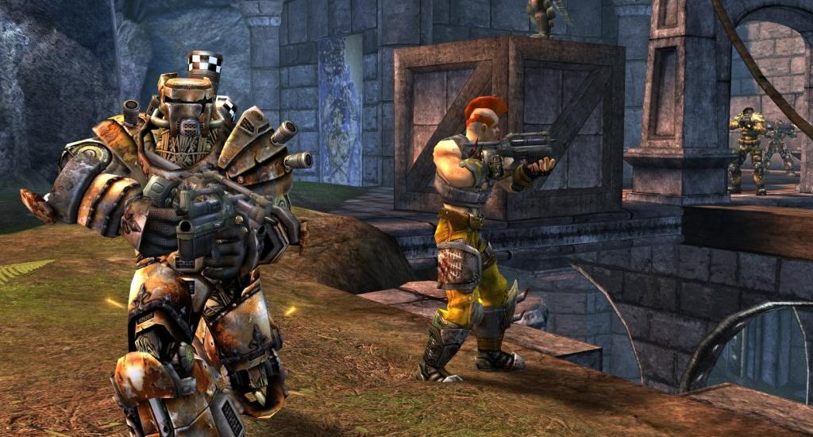

I’m writing this post mostly for me as a reference if/when I want to do this in the future, but these are the steps I followed to get up and running with a UT2k4 server.

# Renting server space online

If you have $5-$10, just get a [DigitalOcean droplet](https://m.do.co/c/6922c697fdd8) ~~or a Linode VPS~~[^1]. Don’t be the guy who hosts on his computer and shackles everyone to whether or not *you specifically* want to play. I know people like this who will host and then just start doing intensive computer tasks (other games) and it messes up the experience. Cough up the cash for a VPS.

I chose Ubuntu as my Linux distro since there’s less to screw around with when getting started and there’s way more support for Ubuntu online if need be.

I found the following tutorials really helpful for getting off the ground:

- [Initial Server Setup with Ubuntu](https://www.digitalocean.com/community/tutorials/initial-server-setup-with-ubuntu) from DigitalOcean
- [What the hell is this Linux nerd shit](https://www.digitalocean.com/community/tutorial_series/getting-started-with-linux) if you don’t know anything about Linux

# Installing UT2k4 using LinuxGSM

The following will install the following required dependencies for running the UT2k4 server on the machine if they aren’t already there.

```bash
sudo dpkg --add-architecture i386; sudo apt update; sudo apt install curl wget file tar bzip2 gzip unzip bsdmainutils python util-linux ca-certificates binutils bc jq tmux netcat lib32gcc1 lib32stdc++6 libsdl1.2debian libstdc++5:i386
```

You can copy and paste this into the terminal and hit enter, it’ll run all the individual commands in order.

Once the dependencies are all settled, create a new user that will be relegated to hosting the server:

```
adduser ut2k4server
```

Set a decent password, please. After the user is created, switch to it with the `su` command:

```
su - ut2k4server
```

It’s strongly advised to **not** just `wget` some random-ass link on the internet, but in this case we gotta trust LinuxGSM

```bash
wget -O linuxgsm.sh https://linuxgsm.sh && chmod +x linuxgsm.sh && bash linuxgsm.sh ut2k4server
```

Once the download is complete, launch the installer:

```
./ut2k4server install
```

Props to [Daniel Gibbs](https://github.com/sponsors/dgibbs64), author and maintainer of LinuxGSM. Open-source work is beneficial for everyone and it’s almost always a thankless job, so if you can scrounge something up, send it his way: https://linuxgsm.com/sponsor/

# Setting up the UT2k4 server

Once LinuxGSM is set up, open up the `ut2k4server.ini` config file in `nano` or whatever command-line text editor you want. The .ini file is located in `{home}/serverfiles/System` but I have the command here for copy-pasting reference:

```
nano serverfiles/System/ut2k4server.ini
```

There are several sections to make adjustments in:

- Engine.GameReplicationInfo
- Engine.AccessControl
- Engine.GameInfo
- XGame
- XInterface.MapList

Then, we’ll need to add map voting.

The map list section will be particularly long since it’ll contain my personal curation of the maps that are good for “UT2k4 Nights” where a group of people just want to hop in and game.

The `;` (semicolon) character represents a “comment” for the .ini file format, meaning it won’t be read by code and is purely for documentation. Anything in `;<angle brackets>` is my inline commentary.

## Engine.GameReplicationInfo

This is the metadata for your server. Kind of useless since I personally have people connecting via IP, but they do see the server name and MOTD.

```ini
[Engine.GameReplicationInfo]

ServerName= ;<Enter your server name here>

ShortName= ;<Optional: Shorthand for your server>

ServerRegion=0 ;<Leave as is, used to be used by the now-defunct Gamespy service as a flag for server location>

AdminName=admin ;<Optional>

AdminEmail= ;<Optional>

MessageOfTheDay= ;<Optional>
```

## Engine.AccessControl

This is where we set the password for admin commands and the server password.

```ini
[Engine.AccessControl]

AdminPassword= ;<Password for admin commands such as changing maps and banning people>

GamePassword= ;<Password for getting into the server>

bBanByID=True
```

## Engine.GameInfo

Thankfully this is right under AccessControl. This controls stuff like server capacity.

```ini
[Engine.GameInfo]

GoreLevel=2 ;<Looked online and this is defined as "Amount of gore displayed in the game". This probably just removes gib creation for everyone?>

MaxSpectators=16 ;<Default is 2, I put it to 16 just in case there happens to be a pickup game situation>

MaxPlayers=16 ;<I set this to 16 because I cannot get more than 11 people to play this game simultaneously in 2021, but you can crank it up>

AutoAim=0.000000 ;<Turn it off, just in case>

;<I leave the rest of this as-is>

GameSpeed=1.000000

bChangeLevels=True

bStartUpLocked=False

bNoBots=False

bAttractAlwaysFirstPerson=False

NumMusicFiles=13

bEnableStatLogging=false

HUDType=Engine.Hud

MaxLives=0

TimeLimit=0

GoalScore=0

GameStatsClass=IpDrv.MasterServerGameStats

SecurityClass=UnrealGame.UnrealSecurity

AccessControlClass=Engine.AccessControl

VotingHandlerType=xVoting.xVotingHandler

MaxIdleTime=+0.0
```

## XGame

The XGame sections represent the settings for the specific gamemodes. Each section looks the same for the most part, so I’ll just drop some of the configs here.

```ini
[XGame.xDeathMatch]

HUDType=XInterface.HudBDeathMatch

MaxLives=0 ;<Leave this at 0 unless you have a party game in mind, allows people to continually respawn until time limit>

TimeLimit=10 ;<This is time in minutes. It defaults to 20 but 10 works better overall for almost all game modes>

GoalScore=25 ;<For deathmatch, this is the number of kills it takes to win. For CTF, this is the number of flag captures it takes to win.>

bTeamScoreRound=False

bPlayersMustBeReady=False

bAllowTaunts=True

bForceRespawn=False

bWeaponStay=true
```

```ini
[XGame.xTeamGame]

HUDType=XInterface.HudBTeamDeathMatch

MaxLives=0

TimeLimit=15

GoalScore=50

bTeamScoreRound=False

bPlayersMustBeReady=False

bAllowTaunts=True

FriendlyFireScale=0

MaxTeamSize=16 ;<This is pretty self-explanatory, but you can use this to limit team size for impromptu competitive events>

bForceRespawn=False

bWeaponStay=true
```

## XInterface.MapList

For some reason, these sections are the ones that *actually* control the list of maps available for a certain gametype and not the `[{alias} MapListRecord]` sections. The 1on1 maps can be placed in these rotations as well, and I suggest doing so: they’re great maps to fall back to when the night wears on and fewer people stay online.

The DM (FFA) and TDM maps can be interchanged, in my opinion, so this list can be used for both.

```ini
[XInterface.MapListDeathMatch]

MapNum=0

;<These maps are great for most gatherings and are the gold standard>

Maps=DM-RANKIN

Maps=DM-CORRUGATION

Maps=DM-DE-IRONIC

Maps=DM-GESTALT

Maps=DM-IRONDEITY

Maps=DM-Deck17

Maps=DM-Antalus

Maps=DM-Asbestos

Maps=DM-Curse4

Maps=DM-1on1-Albatross

Maps=DM-1on1-Crash

Maps=DM-1on1-Desolation

Maps=DM-1on1-Idroma

Maps=DM-1on1-Squader

Maps=DM-HyperBlast2

Maps=DM-TrainingDay


;<These maps are great when you have a full party of 16-ish people but still work as part of a small-party rotation>

Maps=DM-DE-GRENDELKEEP

Maps=DM-DE-OSIRIS2

Maps=DM-METALLURGY


;<I don't have a lot of sentiment gathered for these maps, possibly good but also possibly bad>

Maps=DM-1on1-Mixer

Maps=DM-1on1-Roughinery

Maps=DM-Injector

Maps=DM-Insidious

Maps=DM-Leviathan

Maps=DM-Oceanic


;<These maps just either flat-out suck or are difficult to quickly pick up and play on>

;Maps=DM-RRAJIGAR <Flat out sucks>

;Maps=DM-1on1-Irondust <Lots of elevators and weird height advantage/disadvantage scenarios, not easy to pick up quickly>

;Maps=DM-1on1-Serpentine <Bizarre, generally unfriendly design; weird ground arena where players can fall into trenches>

;Maps=DM-1on1-Spirit <Generic and soulless 1v1 map without any "resting" areas (critical for casual/new players)>

;Maps=DM-1on1-Trite <Another small labyrinth map that's very difficult to traverse>

;Maps=DM-Flux2 <Height advantage 1v1 map, can't be repurposed for casual play>

;Maps=DM-Gael <1v1 map>


;<The following maps are all style, no substance - they're creative but not fun to navigate within or play on>

;Maps=DM-BP2-Calandras

;Maps=DM-BP2-GoopGod

;Maps=DM-Compressed

;Maps=DM-DesertIsle

;Maps=DM-Icetomb

;Maps=DM-Inferno

;Maps=DM-Junkyard

;Maps=DM-Rustatorium

;Maps=DM-Sulphur

;Maps=DM-TokaraForest


;<The following maps are all space-themed "low gravity everywhere" gimmick maps>

;Maps=DM-Goliath

;Maps=DM-Morpheus3

;Maps=DM-Phobos2

;Maps=DM-Plunge <Genuinely cool map design that would otherwise be fun to play>
```

# Enabling map vote

There’s a great wiki called **UnrealAdmin** that’s archived a bunch of scattered details for hosting UT servers. It’s the best location for archiving how to add map voting to the server. I’ll be copying and pasting the config section from the [MapVote (UT24004)](https://wiki.unrealadmin.org/MapVote_(UT2004)) page here as a redundancy, since UT resources have a bad habit of falling off the face of the internet in some fashion.

The MapVote page explains all of these properties in detail, which is useful.

```ini
[xVoting.xVotingHandler]

VoteTimeLimit=100 ;Default is 70 (seconds), even just over a minute isn't enough time for some people 

ScoreBoardDelay=5 

bAutoOpen=True 

MidGameVotePercent=50 

bScoreMode=False 

bAccumulationMode=False 

bEliminationMode=False 

MinMapCount=2 

MapVoteHistoryType=xVoting.MapVoteHistory_INI 

RepeatLimit=2 ;Default is 4, I kind of like 2, still useless if bEliminationMode isn't set to true

DefaultGameConfig=0 

bDefaultToCurrentGameType=True 

bMapVote=True 

bKickVote=False ;It's a private game

bMatchSetup=False 

KickPercent=51 

bAnonymousKicking=True 

MapListLoaderType=xVoting.DefaultMapListLoader 

ServerNumber=1 

CurrentGameConfig=0 

GameConfig=(GameClass="XGame.xCTFGame",Prefix="CTF",Acronym="CTF",GameName="Capture The Flag",Mutators=,Options=) 

GameConfig=(GameClass="XGame.xDeathMatch",Prefix="DM",Acronym="DM",GameName="DeathMatch",Mutators=,Options=)

GameConfig=(GameClass="XGame.xTeamGame",Prefix="DM",Acronym="DM",GameName="Team DeathMatch",Mutators=,Options=)

;Commenting out the game modes that people are simply unable to get enough people for in 2021

;GameConfig=(GameClass="Onslaught.ONSOnslaughtGame",Prefix="ONS",Acronym="ONS",GameName="Onslaught",Mutators=,Options=)

;GameConfig=(GameClass="XGame.xBombingRun",Prefix="BR",Acronym="BR",GameName="Bombing Run",Mutators=,Options=) 

;GameConfig=(GameClass="UT2k4Assault.ASGameInfo",Prefix="AS",Acronym="AS",GameName="Assualt",Mutators=,Options=) 

;GameConfig=(GameClass="XGame.xDoubleDom",Prefix="DOM",Acronym="DOM",GameName="Double Domination",Mutators=,Options=) 

 
[xVoting.DefaultMapListLoader] 

bUseMapList=False 

MapNamePrefixes=DM,CTF

;MapNamePrefixes=DM,DOM,CTF,BR,AS,ONS,VCTF <Default> 
```

# Admin Commands

There’s a litany of garbage forum posts about admin commands that are almost entirely wrong because they were all made by people in their mid to late teens around 2005. Even the UnrealAdmin forums have wrong information about what the right console admin commands are.

When sending a command, it helps to prefix it with `admin`, i.e., `admin map [mapname]`.

## Logging in as admin while in-game

`adminlogin [password]`

Allows the current player to log in as an admin with the specified admin password. This is the password that was set in Engine.AccessControl

`adminlogout [password]`

Reverse of the above, log out from admin.

## Switch to a certain map

`admin map [mapname]?game=gametype?mutator=mutator`

Change from the current map to the specificed map. I believe this is case sensitive? Optional queries allow for specifying whether or not a DM map should be for FFA or TDM and appending mutators.

## Kicking and Banning

`admin kick [playername]`

Kicks a player by name. You probably won’t need this for your friends but I’ve seen internet issues prevent people from rejoining because they’re still “in” the server in the eyes of the server.

`admin kickban [playername]`

Kicks and bans a player by name. You probably won’t need this if you’re doing a private event, but it’s good to know if there are undesirable friends-of-friends.

### Footnotes

[^1]: Linode was bought by Akamai and their offerings are now weirdly priced/downgraded, I've removed the link to what used to be Linode